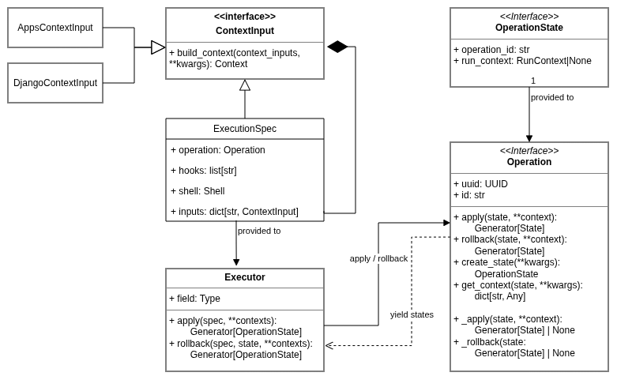

.. _guide-overview:

Overview
========

Ox-Orch is a state-driven orchestration engine for deterministic application lifecycle management.

It provides a structured way to define, execute, and rollback complex workflows such as package installation, migrations
and application reconciliation. It replaces imperative deployment scripts with a composable, state-based execution model.

Quickstart
----------

Define a workflow. Here is an example for a regular Django applications installation or update:

.. code-block:: python

    from ox_orch.operations import AppsPlan, UvInstall, ForkOperation
    from ox_orch.django import DjangoEnable, DjangoReconciliation

    install_apps = AppsPlan(
        install=UvInstall(),
        operations=[
            DjangoEnable(),
            ForkOperation(
                operation=DjangoReconciliation(),
            )
        ]
    )

Both operations and states are serializable as pydantic models, allowing to provide them through API or using configuration files.

Once the workflow is defined, you will execute it like this:

.. code-block:: python

    from ox_orch.operations.execution import Executor, ExecutionSpec
    from ox_orch.apps import Application, AppsContext, AppMemoryStore, AppStateMemoryStore
    from ox_orch.hooks import LoggingHook

    # ...

    # We have to provide apps_ctx to AppsPlan, which gather:
    # - An app store: store applications, here in memory
    # - An app state store: store application states, in memory too;
    # - A list of apps metadata to use
    applications = [
        # By default, package is set to the id
        Application(id="test-1", version="0.0.1"),
        Application(id="test-2", version="1.4.2", package="test-2-pkg"),
        Application(id="test-3", version="1.4.3", package="test-3-pkg")
    ]

    apps_ctx = AppsContext.from_apps_ids(
        ["test-1", "test-2"],
        store=AppMemoryStore(items=applications),
        state_store=AppStateMemoryStore(),
    )

    spec = ExecutionSpec(
        # The operation to execute
        operation=install_apps,
        # Add a hook that logs all states changes
        hooks = [LoggingHook()],
        # Some user input values if needed.
        # inputs={},
    )
    executor = Executor()

    # Dummy invocation example, when you need to get state, eg. feedback to
    # to client's API.
    for state in executor.apply(spec, apps_ctx=apps_ctx):
        print(f"[{state.operation_id}] {state.status}")

    # Another way to invoke without looping over it:
    state = executor.apply_sync(spec, apps_ctx=apps_ctx)

Rollback becomes trivial:

.. code-block::

    rb_state = executor.rollback_sync(spec, state, apps_ctx=apps_ctx)

    # That's it.

Concepts
--------

The two main concepts in Ox-Orch are *Operation* and *State*.

An operation describes a unit of behavior that can be applied and rolled back.
A state represents the current and historical execution information associated
with that operation.

Together they provide a deterministic execution model where every action
produces an explicit state transition. Most other components of Ox-Orch
(executors, plans, hooks and stores) exist to coordinate, observe or persist
those transitions.

Small summary of the concepts:

Where is a brief overview of the main classes and their relations:

- Operation:

    - The core abstraction to run an action. A :py:class:`~ox_orch.operations.plan.Plan` allows to run multiple child operations sequentially;
    - It has an apply and rollback methods;

- Operation State: keep track of the operation execution state, also used for rollbacking into the previous state.

- Context: data provided to the operation (and children), as stores, resolved object, etc.
- ContextInput: user input value used to build contexts (as object id, etc.);
- Executor: the class responsible to run the operation, providing feedback about what is happening (yield states, run hooks, etc.).
- ExecutorSpec: provide input values to apply/rollback the executor.

Other objects that you will encounter:

- Store: store data in order to reuse them, using different backends (memory, file, extensible). Used for states, applications and their state, etc.
- Registry / RegisteredClass / register: allows to register classes to different registries. This is used at a lot of places, as for operation and their state classes, context inputs, etc.

Executor
........

The executor is the main utility class that you'll need to run operations. It handles:

- Load a provided configuration (:py:class:`~ox_orch.operations.execution.ExecutionSpec`);
- Initialize the context used for running operations;
- Run the operation(s), calling hooks at different stages;
- Create and manage operation states;
- Coordinate state persistence through stores;
- Handle rollback execution;
- Restore previous execution states when provided;
- Emit execution events and notifications;
- Provide synchronous and streaming execution APIs;
- Propagate execution context to nested operations;

Store
.....

Stores are responsible for persisting data used by the orchestration engine.

Ox-Orch distinguishes between two broad categories of stores:

- Metadata stores, which provide access to managed resources;
- State stores, which persist operation execution states.

Stores may use various backends such as in-memory implementations,
filesystems, databases or remote services.

By abstracting persistence behind dedicated interfaces, operations remain
independent from the underlying storage technology.
