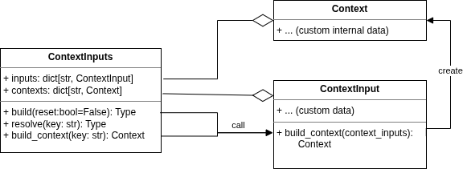

.. _guide-contexts:

Contexts
========

When working with operation you want use contexts to by pass values. As you might have noticed, we can provide ``apply`` and ``rollback`` methods arbitrary named arguments. Those form the *context*, allowing operation to be stateless.

It means that operation's fields only are configuration that shall persist around multiple runs.

When developping your own operation, you'll be tempted to directly provide raw values as operation context -- like we did in previous examples of this guide. But soon the deduplication and missing coherent, documented structure will arise among other problems.
Thats the exact reason of the ContextInput and Context existence:

- :py:class:`~ox_orch.core.contexts.ContextInput`: user input data, eg. a list of application names;
- :py:class:`~ox_orch.core.contexts.Context`: internal data structures, as a stores;

This distinction is important, as we never may consider user input fully secure. We need data validation here. Also, we want user to be able to provide serialized data, which are transformed into internal structure.

So:

- The ContextInputs takes multiple ContextInput as entry data, and will :py:meth:`~ox_orch.core.contexts.ContextInputs.build` all the required contexts with it.
- A ContextInput is a pydantic model that declare fields used a input data, and convert them to a Context, using its :py:meth:`~ox_orch.core.contexts.ContextInput.build_context`.
- When building the context, you can reuse data from existing other contexts, using :py:meth:`~ox_orch.core.contexts.ContextInputs.resolve`. This method will either get or create the required context.
- To be usable, ContextInput MUST be registered: it allows the ContextInputs to resolve unknown inputs by their key. The registration key is the same as used in ``build_context``, or ``resolve``, and will be used as operation context argument.

.. code-block:: python

    from __future__ import annotations
    from ox_orch.core import ContextInput, Context, register
    from ox_orch.apps import Application

    @register("my_input")
    class MyContextInput(ContextInput):
        apps: list[str]

        # This method MUST be implemented of course
        def build_context(self, context_inputs) -> MyContext:
            # Here is an example: get or create apps_ctx, use its store
            # to get Application by id.
            apps_ctx = context_inputs.resolve("apps_ctx")
            return MyContext(
                apps=apps_ctx.store.get_all(self.apps)
            )

    class MyContext(Context):
        apps: list[Application]

Example usage:

.. code-block:: python

    inputs = {
        # ... apps_ctx, etc.
        "my_input": MyContextInput(apps=["app_1", "app_2"]),
    }
    context_inputs = ContextInputs(
        inputs=inputs,
        # optional: contexts={...}
    )

    context_inputs.build()
    assert context_inputs.contexts["my_input"]

Not really practical as is, but this is actually some details about how the :py:class:`~ox_orch.operations.execution.Executor` works. Lets walk through it into the next section: :ref:`guide-execution`.

.. important::

    You should ALWAYS sanitized user context input when it is provided from untrusted source. The main purpose of ContextInput is first to allow custom input data from
    any kind of user interface.

    For example, the :py:class:`~ox_orch.operations.apps.AppsContextInput` allows
    to provide custom initial arguments to the application store, as a file path. This is
    something you want for CLI, but not from an API endpoint.

Context and operations
----------------------

As you've might have understood, contexts will be passed from parent to child operations. This comes with a tradeoff: polluted and growing contexts. You might also to enforce some input context values types, or cleaner method signatures.

To avoid this, you may provide different attributes on Operation classes:

- :py:attr:`~ox_orch.operations.base.Operation.__apply_spec__`: validate context values for ``_apply``, and shrink;
- :py:attr:`~ox_orch.operations.base.Operation.__rollback_spec__`: validate context values for ``_rollback``, and shrink;
- :py:attr:`~ox_orch.operations.base.Operation.__full_context__`: don't shrink, only validate context;

The two first attributes may have one of the following forms:

- ``None`` (default value on Operation): nothing to validate, no shrinking
- a list of context keys;
- a dict of context keys and allowed value type(s): it will be checked against ``isinstance``, allowing type union;

.. code-block:: python

    class MyOperation(Operation):
        __apply_spec__ = {
            # Either None or
            "my_ctx": (MyContext, None|int),
            "exec_ctx": ExecutionContext
        }
        # For the sake of example
        __rollback_spec__ = None

        def _apply(self, state, exec_ctx=None, my_ctx=None):
            pass

    op = MyOperation()
    state = op.create_state()

    # This works:
    op.apply(state, exec_ctx=ExecutionContext(), name="Alice")

    # The followings raise ValueError:
    op.apply(state, exec_ctx=123)
    op.apply(state)

When ``__full_context__=True``, all context values will be passed down:

.. code-block:: python

    class MyOperation(Operation):
        __apply_spec__ = ["my_ctx", "exec_ctx"]
        __full_context__ = True

        # Notice "**kwargs"
        def _apply(self, state, exec_ctx=None, my_ctx=None, **kwargs):
            pass

This attribute is used for example when you have nested children operation but you want
to ensure the presence of the specified context items.
