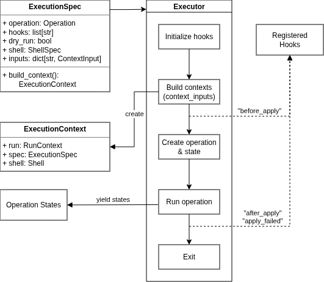

.. _guide-execution:

Execution
=========

We have seen how operations work, and part of the elements composing the stack of ox-orch. Lets discover an important one, as it is the entry point for it, ensuring the connection between user interface and the operation.

Basically:

- The :py:class:`~ox_orch.operations.execution.ExecutionSpec` provide initial arguments to the Executor (apply / rollback).
- The :py:class:`~ox_orch.operations.execution.Executor` method will:
    - Ensure context initialization and run the operation.
    - Emit event to registered hooks at different stages (see :py:mod:`ox_orch.hooks`).
    - Run the operation yielding back operation states;
- :py:class:`~ox_orch.operations.execution.ExecutionContext` will be provided as ``exec_ctx`` context value;

*So why an executor?*

Providing in simple operation don't seems to worth it. However lets look it differently:

- As the number of nested operations of a Plan grows, they will require more and more context data;
- We want the end user to provide input for those context in a coherent way;
- We want extra arguments to provide to all operations, as dry-run or the :py:mod:`~ox_orch.core.shell` to use (nb: allowing to run shell commands).
