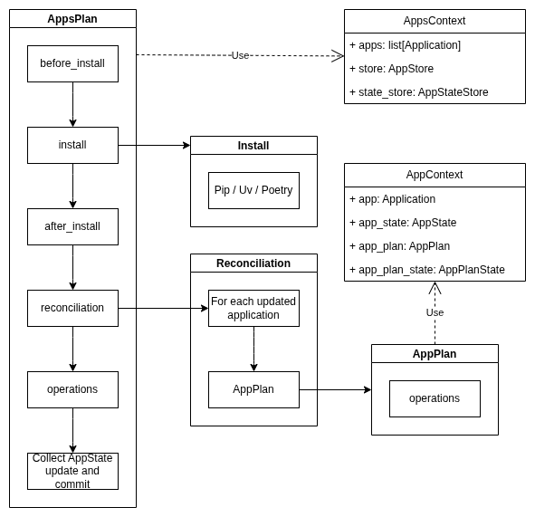

.. _guide-applications:

Applications
============

One of the primary goals of the ox-orch's creation is to be able to install, upgrade, downgrade, uninstall python project, with clean reconciliation and pre-/post-operations workflow.

The main module for applications is :py:mod:`ox_orch.apps`, operations related to the module in :py:mod:`ox_orch.operations.apps` (re-exported by :py:mod:`ox_orch`).

Here are the main objects you encounter in :py:mod:`ox_orch.apps`:

- :py:class:`~ox_orch.apps.app.Application`: provide information about a package to install (id, package, version, etc.). It declare dependencies to other Application instances.
- :py:class:`~ox_orch.apps.state.AppPlanState`: state of an application, as installed version, package, etc.
- :py:class:`~ox_orch.apps.store.AppStore`: store of Application;
- :py:class:`~ox_orch.apps.state_store.AppPlanStateStore`: store of application states;

And operations:

- :py:class:`~ox_orch.operations.app.AppPlan`: a plan applied to each updated package.
- :py:class:`~ox_orch.operations.app.ReconciliationPlan`: detect updated packages (including dependencies) and run an AppPlan for each;
- :py:class:`~ox_orch.operations.app.AppsPlan`: main plan for install/update of packages;
- :py:class:`~ox_orch.operations.install.PipInstall`, :py:class:`~ox_orch.operations.install.UvInstall`, :py:class:`~ox_orch.operations.install.PoetryInstall`: install packages using different package managers;

The basic workflow of application installation looks like this:

- A :py:class:`~ox_orch.operations.apps.AppContext` is provided to the AppsPlan apply/rollback method;
- The AppPlan run:

    - Package installation
    - Application reconciliation
    - Other operations
    - Then collect all application state and commit them to the state store;

- The reconciliation detects applications that are updated:

    - It resolve dependencies declared by each Application from the store;
    - Then detect updated ones;
    - Run the AppPlan for each;

.. note::

    About dependencies: ox-orch does not look at the actual python package ones.
    It rather will use those declared on the Application's :py:attr:`~ox_orch.apps.app.AppRelease.dependencies`.

.. code-block:: python

    from ox_orch.apps import Application, AppsContext, AppMemoryStore, AppPlanStateMemoryStore
    from ox_orch.hooks import LoggingHook

    applications = [
        Application(id="test-1", version="0.0.1"),
        # Example of declaring a dependency
        Application(id="test-2", version="1.4.2", package="test-2-pkg", dependency=["test-1==0.0.1"]),
        Application(id="test-3", version="1.4.3", package="test-3-pkg")
    ]

    apps_ctx = AppsContext.from_apps_ids(
        ["test-1", "test-2"],
        store=AppMemoryStore(items=applications),
        state_store=AppPlanStateMemoryStore(),
    )

    install_apps = AppsPlan(
        install=UvInstall(),
        # Reconciliation can be provided directly an AppPlan or an AppPlan operations.
        reconciliation=[
            DummyOperation(),
        ]
    )

Application State
-----------------

The :py:class:`~ox_orch.operations.apps.AppPlanState` attribute :py:attr:`~ox_orch.operations.apps.AppPlanState.facts` store partial updates to apply to the
current application. Rather than directly update it, you have to use the :py:meth:`~ox_orch.operations.apps.AppPlanState.add_facts` method, as it handle particular cases for merging.

Then this is to the reconciliation to gather all those facts such as the calling AppsPlan can use them to update the application state store. Why? Because other operations than reconciliation can also update application states, as install plans does.

How to provide a state update?

From an operation put inside the AppPlan:

.. code-block:: python

    class MyOp(Operation):
        def _apply(self, state, app_plan_state, **kwargs):
            # ...
            app_plan_state.add_facts({
                "version": "1.0.2"
            })

    # ...
    apps_plan = AppsPlan(
        # Remember? You can provide reconciliation's app plan directly
        reconciliation=[MyOp]
    )

From an AppsPlan nested operation:

.. code-block:: python

    from ox_orch.core import ChangeSet
    from ox_orch.operations import Operation, OperationState

    # Any ChangeSet instance will be read from AppsPlan as application
    # state change.
    class MyOpState(ChangeSet, OperationState):
        pass

    class MyOp(Operation):
        def _apply(self, state, app_plan_state, **kwargs):
            # ...
            state.add_change("app_id", {
                "version": "1.0.2"
            })

    # ...
    apps_plan = AppsPlan(
        operations=[MyOp]
    )

Features
--------

You can provide extra information for applications at different places:

- :py:class:`~ox_orch.apps.app.Application`: using :py:class:`~ox_orch.apps.app.AppFeature`;
- :py:class:`~ox_orch.apps.state.AppState`: using :py:class:`~ox_orch.apps.state.AppStateFeature`;
- :py:class:`~ox_orch.apps.state_store.AppStateStore`: using :py:class:`~ox_orch.apps.state_store.AppStateStoreFeature`;

The three classes have a ``features`` attribute that keeps the information.

Basically a feature is a registered class, that you register using the same key for both places. The place determine the usage, as on Application it is meant to be kinda static, while on a state it is meant to change among operation usages.

.. code-block:: python

    from ox_orch.core import register
    from ox_orch.apps import AppFeature, AppStateFeature

    @register("django")
    class DjangoAppFeature(AppFeature):
        settings_module: str
        project_path: Path

    @register("django")
    class DjangoStateFeature(AppStateFeature):
        enabled: bool = False
        comment: str|None = None

Usage:

.. code-block:: python

    # Example from within an AppPlan apply:
    app_ctx.app_plan_state.add_change(
        {"features": {"django": {"enabled": True}}
    )

Note that features nested data will be merged nicely, meaning that:

.. code-block:: python

    app_ctx.app_plan_state.add_change(
        {"features": {"django": {"comment": "Hello!"}}}
    )

    assert app_ctx.app_plan_state.facts["features"]["django"] == {
        "enabled": True,
        "comment": "Hello"
    }

When those changes are committed to the store, this one will ensure data to be created
if they are missing.
